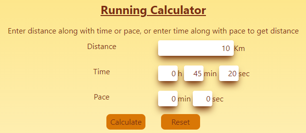
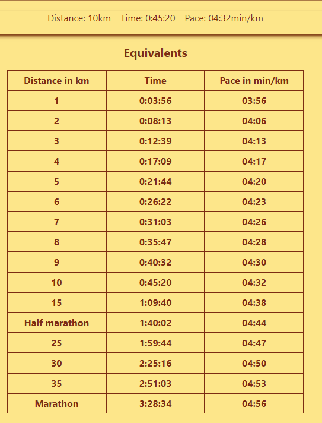
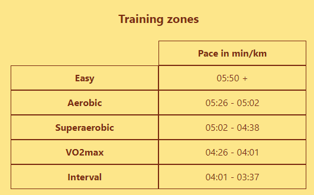

## Table of Contents

1. [General Info](#general-info)
2. [Technologies](#technologies)
3. [Installation](#installation)
4. [Collaboration](#collaboration)
5. [Contact](#contact)

### General Info

---
🚀 Deploy: [Pacer app](https://pacer-app.vercel.app/)

The objective of this application is to calculate pace, time and distance for runners.


Input distance along with time or pace for that distance and press calculate.




Then you will be able to see equivalents for other distances and training zones.








## Technologies

---

A list of technologies used within the project:

* [React](https://es.reactjs.org/): Version 18.1.0
* [Redux](https://es.redux.js.org/): Version 4.2.0

---

## Installation

---

A little intro about the installation.

```
$ git clone https://github.com/Nelnico08/pacer-app.git
$ cd ../path/to/the/file/client
$ npm install
$ npm run dev
```

## Collaboration
***
Hi! If you want to collaborate with the project you can make a fork and a pull request, I will take a look at it and if it's all okay I will merge it with the main branch. Thank you for your interest in the project! :smile:
## Contact
***
<p align="left"> <a href="https://github.com/Nelnico08" target="_blank" rel="noreferrer"></a> <a href="https://www.instagram.com/nelnico08/" target="_blank" rel="noreferrer"></a> <a href="https://www.linkedin.com/in/nnescurra/" target="_blank" rel="noreferrer"></a></p>
